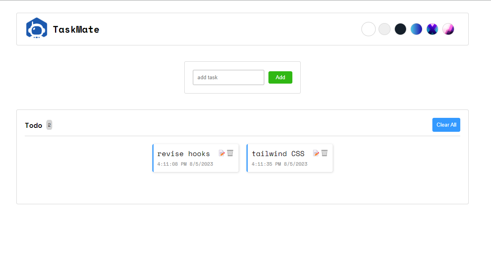
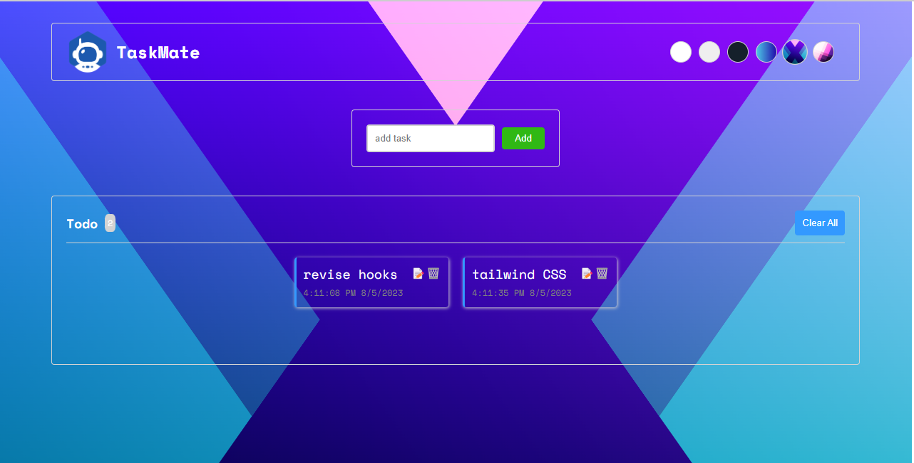

# Task Mate App

Welcome to Task Mate - Your Ultimate Task Management Application!

## Overview

Task Mate is a stunning and user-friendly task management app that allows you to organize your daily tasks efficiently. This app is built using Create React App (CRA) and incorporates various exciting features to enhance your productivity and provide a delightful user experience.

## 📸 Screenshots

## Features

- **Add Task**: Easily add new tasks by providing a title, description, and due date. Stay organized with just a few clicks!

- **Edit Task**: Made a mistake or need to update a task? No worries! Task Mate enables you to edit task details at any time.

- **Delete Task**: Completed a task or decided it's no longer relevant? You can swiftly delete tasks and keep your task list tidy.

- **Local Storage**: Never lose your tasks, even if you close the app or refresh the page. Task Mate utilizes local storage to save your tasks securely on your device.

- **6 Background Themes**: Customize your task management experience with a choice of six stunning background themes. Find the one that best suits your style and mood.

- **Global Context for Theme**: Seamlessly switch between background themes across all app screens using the global context feature.

- **Vanilla CSS for Styling**: Task Mate is beautifully styled using Vanilla CSS to ensure a visually appealing and modern look.

## Getting Started

Follow these simple steps to get Task Mate up and running:

1. Clone this repository to your local machine using `https://github.com/purohitdheeraj/taskmate.git`.

2. Navigate to the project directory: `cd task-mate`.

3. Install the necessary dependencies: `npm install`.

4. Start the development server: `npm start`.

5. Task Mate will open automatically in your default web browser. If it doesn't, access the app at `http://localhost:3000` in your browser.

